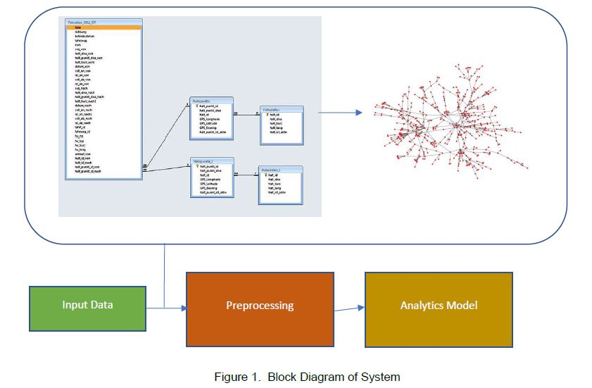
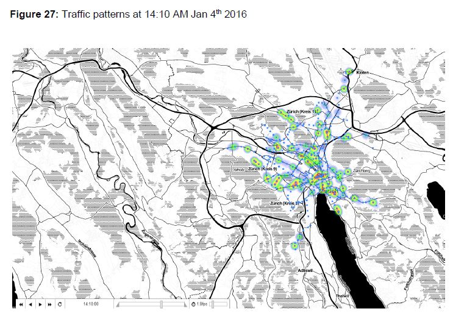

# Variational Graph Representation Learning and Graph Signal Processing
## You may download the full report [here](https://github.com/codenameAggie/traffic_graph_VGAE/blob/master/Arash_Abdollahzadeh_Final_Report.pdf).
---

# Getting started:
## For further information, please contact Arash Abdollahzadeh at aa75442@tamu.edu or find me on LinkedIn!
https://www.linkedin.com/in/arash-abdollahzadeh/

## Get the data:
To get the raw files, refer to "https://data.stadt-zuerich.ch/dataset?q=vbz".

Years 2015 to 2020 may be found there; however, the notebooks expect first two weeks of 2016's data, so you may download 2016's data here: "https://data.stadt-zuerich.ch/dataset/vbz_fahrzeiten_ogd_2016".

In addition to the weekly data, be sure to download Haltestelle.csv (stops) and Haltepunkt.csv (stations) as well! Place the files in a directory named travel_times_2016 for example, or modify the first couple of cells of each notebook.

There's a data dictionary located on the website referred above.

## Dependencies:

Run the following lines to install the dependencies or install them via pip or conda.

! pip install matplotlib\
! pip install numpy\
! pip install pandas\
! pip install seaborn\
! pip install scikit-learn\
! pip install scipy\
! pip install geopy\
! pip install folium\
! pip install networkx\
! pip install cartopy

## The notebooks:

### The notebooks are desgined for a granular technical deep-dive into the EDA and signal/graph modeling. For generating a new graph, use notebook #6.

The notebooks are designed to be explored sequentially. Notebooks 1 - 5 were the result of exploratory data analysis done by Arash Abdollahzadeh, oversaw by Dr. Nick Duffield; it was an effort to define a graph, representing the network of the public transportation of city of Zurich, and define signals on that graph as time-series indices of traffic (modeled via normalizing the difference between the actual travel times of vehicles from expected travel times by the expected travel times).

### Nodes:
Nodes represent the midpoint of each route.
### Edges:
Edges are defined by two methods:

    Distance(dist): If the distance of the two nodes (midpoint of the route in a physical sense) is less than the specified amount.
    Junction: Whether two nodes (routes) share a punkt (bus/tram stop).

The graph is taken to be undirected.

### Signals:
Signals were modeled by finding the difference between the actual travel time and nominal travel time (predetermined by Zurich public transportation system), and then normalizing by the nominal travel time for each route. If there were more than one instance of such measurement for a given time, for a given route, the measurements were simply aggregated via averaging.

Notebook 6 is where the graph is created, and it contains scripts for the graph construction, signal creation, and some visualization.

Notebook 7 creates a time-evolving map based on the signals and the gps data extracted from the previous notebooks. Be sure to check the notebook closely as there are some caveats with the package that generates those visualizations.

